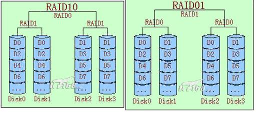

# 服务器安装硬盘

## 基本知识

### Q: 什么是 RAID

|       | 说明                                      | 优点                       | 缺点                         |   |
|-------|-----------------------------------------|--------------------------|----------------------------|---|
| RAID0 | 存储数据被分割成两部分，分别存储在两块硬盘上                  | 存储速度是单块硬盘的2倍             | 任何一块硬盘发生故障，整个RAID上的数据将不可恢复 |   |
| RAID1 | 两块硬盘互为镜像。当一个硬盘受损时，换上一块全新硬盘(大于或等于原硬盘容量)。 | 任何一块硬盘出现故障是，所存储的数据都不会丢失。 | 实际容量比较小,仅仅为两颗硬盘中最小硬盘的容量    |   |

### Q: RAID10 和 RAID01 的比较

- RAID10 是先做镜象，然后再做条带。
- RAID01 则是先做条带，然后再做镜象。

    

1. 安全性方面的比较

    下面以 4 块盘为例来介绍安全性方面的差别：

    - RAID10 的情况
        我们假设当 DISK0 损坏时，在剩下的 3 块盘中，只有当 DISK1 一个盘发生故障时，才会导致整个 RAID 失效，我们可简单计算故障率为 1/3。

    - RAID01 的情况
        我们仍然假设 DISK0 损坏，这时左边的条带将无法读取。在剩下的 3 块盘中，只要 DISK2，DISK3 两个盘中任何一个损坏，都会导致整个RAID 失效，我们可简单计算故障率为 2/3。

    因此 RAID10 比 RAID01 在安全性方面要强。

1. 读写速度的比较

    从数据存储的逻辑位置来看，在正常的情况下 RAID01 和 RAID10 是完全一样的，而且每一个读写操作所产生的 IO 数量也是一样的，所以在读写性能上两者没什么区别。而当有磁盘出现故障时，比如前面假设的 DISK0 损坏时，我们也可以发现，这两种情况下，在读的性能上面也将不同，RAID10 的读性能将优于 RAID01。

### Q: RAID10 和 RAID5 的比较

为了方便对比，这里拿同样多驱动器的磁盘来做对比，RAID5选择3D+1P的RAID方案，RAID10选择2D+2D的RAID方案，如图：

1. 安全性方面的比较

    其实在安全性方面，勿须质疑，肯定是 RAID10 的安全性高于 RAID5。我们也可以从简单的分析来得出。当盘 1 损坏时，对于 RAID10，只有当盘1对应的镜象盘损坏，才导致 RAID 失效。但是对于 RAID5，剩下的 3 块盘中，任何一块盘故障，都将导致 RAID 失效。

    在恢复的时候，RAID10 恢复的速度也快于 RAID5。

1. 空间利用率的比较

    RAID10 的利用率是 50%，RAID5 的利用率是 75%。硬盘数量越多，RAID5的空间利用率越高。

### Q: RAID 其他模式

1. BIG 模式：BIG 模式是即硬盘盒的默认模式，在这种模式下，两块硬盘将被简单地捆绑合并为一块硬盘，硬盘的性能和读写速度与单块硬盘相同，移动硬盘的总容量等于两块硬盘容量之和。当写入数据时，系统会指定数据从第一个磁盘开始存储，当第一个磁盘的存储空间用完后，再依次从后面的磁盘开始存储数据。如果第一块磁盘的数据出现损坏，那么两块硬盘的数据将完全丢失。

1. JBOD 模式: 在 JBOD 设置下，硬盘盒不使用任何 RAID 模式。在 JBOD 状态下，硬盘盒内的 2 块硬盘模式均出于独立运行的状态，在系统中也被识别为两颗独立的硬盘，用户可以任意选择存储文件的硬盘。如果其中一块硬盘损坏，另一块硬盘上的数据不受干扰。 备注：相当于普通的硬盘盒模式。

### Q: 什么是 mdadm

    RAID 有硬实现和软实现，mdadm 是 Linux 下的软实现。

## 硬件选购

### Q: 选购硬件


## 服务器配置

- RAID

    hard or soft

- LVM

    LVM is great if you use it from the start, but a pain in the but if you change your mind later. I would back up all of your data and reinstall from scratch and setup all of your drives for LVM and then restore the data from before.

- mhddfs

    file system for unifying several mount points into one

- unionfs-fuse

    Fuse implementation of unionfs

### Q: `/home/` or `/data/` 增加空间

冲突：多个硬盘合并为一个文件，如果一个硬盘出现问题，整体可能都不能用。

- RAID0 无法恢复
- mhddfs： 存储时按照第一块硬盘，接着放第二块硬盘。（第一块硬盘坏掉，可能不会影响第二块硬盘的使用）

### Q: 安装 mhddfs

- Install: https://romanrm.net/mhddfs

    ```bash
    mhddfs /mnt/a/,/mnt/b/,/mnt/c/ /storeall/
    ```
    where /mnt/a/,/mnt/b/, and /mnt/c/ are three different mount points which can be from three different hard drives.

    You can unmount like this:
    ```bash
    fusermount -u /storeall
    ```
    [ref](
    https://serverfault.com/questions/191299/can-we-mount-multiple-disks-as-one-directory)

### 配置硬盘

1. 查看分区，sda是第一块SCSI硬盘，sdb第二块，以此类推...物理分区使用a、b编号
    ```bash
    sudo fdisk -l  查看有没有分区
    ```

1. 分区
    ```bash
    sudo fdisk /dev/sdb
    ```
    然后
    1. 提示Command(m for help):n
    1. 选择p主分区（如果是扩展分区就写e）
    1. Partition number(1-4):1
    1. First cylinder(...):1
    1. Command(m for help):p   这一步确认没有问题了就用w命令，将分区信息写入系统，保存退出
    1. Comand(m for help):w

1. 格式化硬盘，把创建的新硬盘分区格式化成ext4

    ```bash
    sudo mkfs -t ext4 /dev/sdb1 
    ```
1. mount，就是挂接上

    ```bash
    sudo mount /dev/sdb1 /home/
    ```

1. 为了启动能够自动 mount

    ```bash
    # 编辑/etc/fstab文件
    sudo gedit /etc/fstab
    # 在最后面加入一行：
    /dev/sdb1  /home   ext4 defaults 0 0
    # 保存退出就可以了
    ```

ref: https://zhidao.baidu.com/question/1509329786129561980.html

### 配置 mhddfs

```bash
# 多个文件合并成一个文件
mhddfs /path/to/dir1,/path/to/dir2[,/path/to/dir3] /path/to/mount
# 取消
fusermount -u /path/to/mount
```